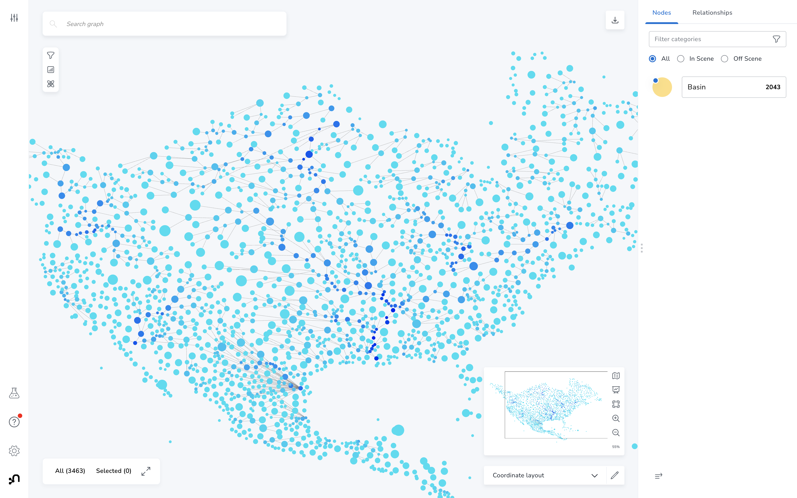

# Water Graph 🌊

Analyzing the world's water with Neo4j 

# Data

## HydroBASINS

### Preprocesing

HydroBASINS data is available for download in shapefile format from [https://www.hydrosheds.org/products/hydrobasins](https://www.hydrosheds.org/products/hydrobasins)


I loaded the shapefiles in QGIS, then:

1. Used the Processing >> Fix Geometry tool to resolve any invalid polygon geometries.
2. Used the Vector >> Centroids tool to calculate centroids for each basin polygon
3. Exported the layer as GeoJSON, which can be loaded into Neo4j using `apoc.load.json`

### Neo4j Import

Each basin feature is uniquely identified by a `HYBAS_ID` value. The downstream basin is identified by its `HYBAS_ID` value in the `NEXT_DOWN` field.

```Cypher
CREATE CONSTRAINT FOR (b:Basin) REQUIRE b.HYBAS_ID IS UNIQUE
```

```Cypher
CALL apoc.load.json("https://raw.githubusercontent.com/johnymontana/water-graph/main/data/hydrobasins/basins_na_lev6_centroids.geojson") YIELD value
UNWIND value.features AS feat
MERGE (b:Basin {HYBAS_ID: feat.properties.HYBAS_ID})
SET b.location = point({latitude: feat.geometry.coordinates[1], longitude:feat.geometry.coordinates[0]}),
    b.sub_area = feat.properties.SUB_AREA,
    b.coast = feat.properties.COAST,
    b.PFAF_ID = feat.properties.PFAF_ID,
    b.upstream_area = feat.properties.UP_AREA

MERGE (next:Basin {HYBAS_ID: feat.properties.NEXT_DOWN})
MERGE (b)-[r:FLOWS_INTO]->(next)
SET r.distance = feat.properties.DIST_SINK
```

FIXME: ignore basins where NEXT_DOWN == 0

```Cypher
MATCH (b:Basin) WHERE b.HYBAS_ID = 0
DETACH DELETE b
```

### Analysis


